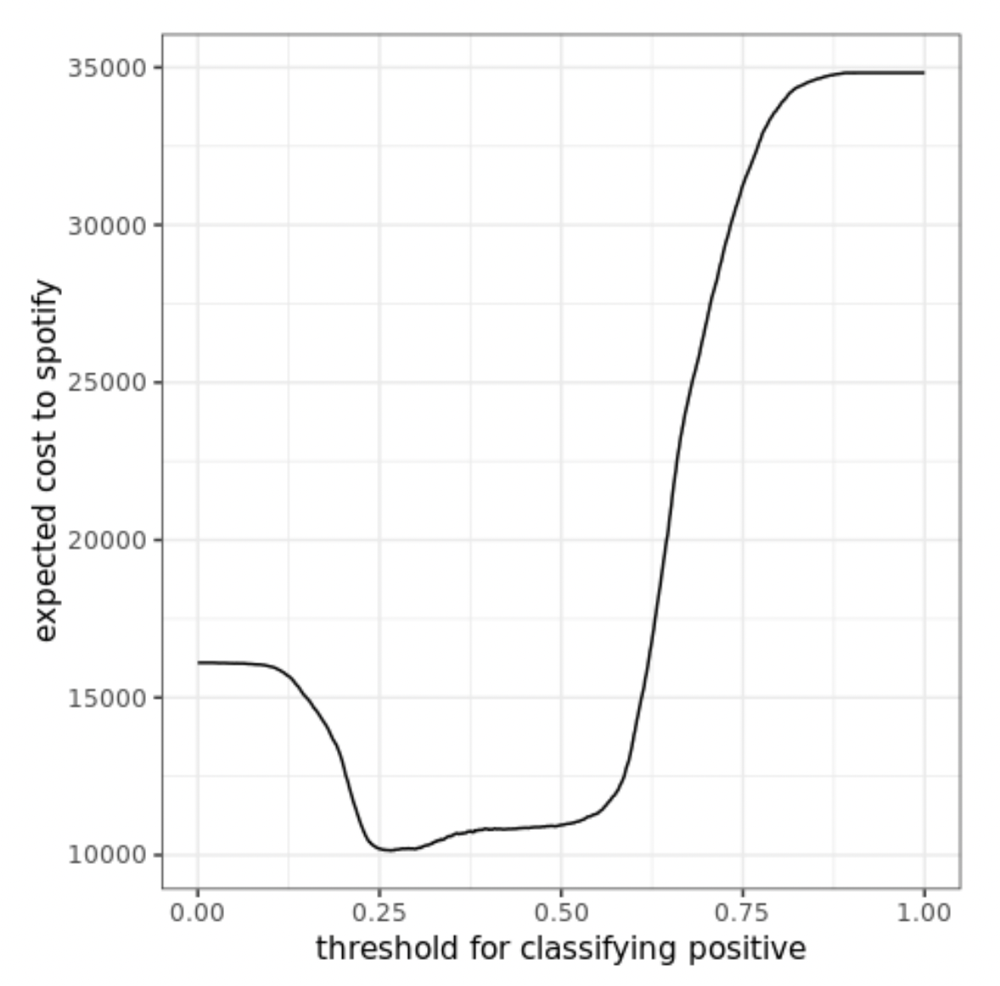
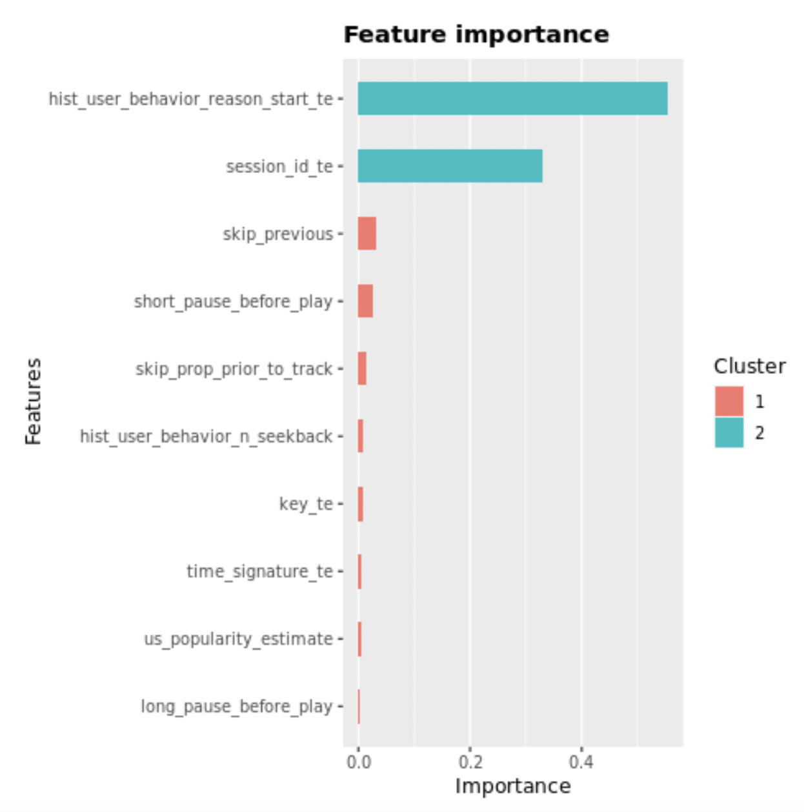

<h1> Predicting sequential track-skipping XGBoost: Accuracy of 76.8%</h1>
I competed in the Spotify Sequential Skip Prediction Challenge, and emerged top 7% out of 1350 participants.
 
<li> Windowed feature engineering for sequential information.
<li> Regularized k-fold target encoding of categorical features.
<li> Hyperparameter tuning using Bayesian Optimization.
<li> Threshold-moving to minimize expected costs in real-world model deployment.
 
# About
A central challenge for Spotify is to recommend the right music to each user. While there exists a large body of work on recommender systems, there is at present little work describing how users sequentially interact with the streamed content they are presented with. Music content is unique in that the question of if, and when, a user skips a track is an important implicit feedback signal on the quality of the system's recommendation.

I explore this important and understudied problem in music streaming by building a machine learning model that predicts whether a user will skip or listen to tracks that they are streamed, given their immediately preceding interactions in a listening session.

# The Cool(er) Findings: Threshold-moving for real-world model deployment
As opposed to simply using the default decision threshold of 0.5 to classify a positive condition, threshold-moving is important in the real-world deployment of models. The default threshold of 0.5 will only be optimal if the business costs of a False Negative (FN) and a False Positive (FP) are equal. However, this is rarely the case in reality.

In this project, an FP occurs when a song is identified to be skipped and thus not recommended to a user, but in fact would not have been skipped. Hence, costs are incurred due to the user not being exposed to a song he would have enjoyed. However, this presents a relatively lower cost to Spotify since user satisfaction is unaffected.

On the other hand, a FN occurs when a song identified to not be skipped is in fact skipped by a user. Costs are incurred due to lower user satisfaction with the streaming service. This presents a much higher cost to Spotify. As such, the costs of FP and FN are unequal.

I assume that a FN generates twice the cost of a FP for Spotify. For each decision threshold, I obtain the resulting confusion matrix and subsequently compute expected costs as 2𝐹𝑁 + 𝐹𝑃, resulting in the below graph:
 

The optimal threshold is the one resulting in the minimum expected cost. This optimal threshold is found to be 0.2655, ie. a track is classified to be skipped as long as its predicted probability from the final XGBoost model is above 0.2655.

# Methodology
## 1. Feature engineering to capture sequential information
Since the aim of this paper is to predict sequential track-skipping behaviour, it is crucial to engineer smart features that are able to capture the sequential nature of our data. This is further pivotal when utilizing algorithms that are not inherently optimized for modelling sequential data. Some of the features engineered for this include:
 
<li>skip_previous: Binary variable that depicts if the track encountered right before the current one was skipped by the user.
 
<li>skip_prop_prior_to_track: Depicts the proportion of skips that the user has made on all tracks encountered prior to the current track.
 
<li>skip_prop_prior_to_track_SD: Depicts the standard deviation of skip_prop_prior_to_track at each point in time. This depicts the consistency of the user’s skipping action prior to the current track. For instance, skip_prop_prior_to_track_SD=0 on track 5 implies that the user had made the same action on all of the 4 prior tracks (either skipped all or not skipped all). We can therefore be more certain of the predictive power of skip_prop_prior_to_track for forecasting user action on this 5th track, since the user is very likely to also make the same action. As such, the lower the skip_prop_prior_to_track_SD, the more consistent the user’s past track-skipping behavior, and the more certain we are in predicting user action on the next track.

In particular, skip_previous and skip_prop_prior_to_track are found to be among the most important predictors of track-skipping behavior:
 

## 2. Encode categorical features
I use regularized k-fold target encoding. The usage of k folds ensures that the target value of an observation is not used to compute its target-encoded predictors. Instead, other observations in the training data are used. The dataset is first split into k folds, and the means for each category in the 𝑖^𝑡ℎ fold is computed using data in the other k-1 folds. To further prevent overfitting, I additionally add random noise into the target-encoded values for each category. This provides extra regularization to the k-fold target encoding.

## 3. Select metric of focus
The metrics of particular significance in our specific business case are:
 
<li>Recall: It is of greater business utility to identify tracks that will be skipped over ones that will not. Identification of these songs can pave the way for Spotify to improve on their track recommendation system.
 
<li>Precision: It is important for the model to be certain when identifying a track that will be skipped.
 
<li>F2-Score: Given our combined emphasis on both Recall and Precision, I ultimately look at the F2-Score as a combined measure of both. In particular, choosing the F2-Score over the more commonly utilized F1-Score implies Recall is weighed twice as heavily as compared to Precision, as opposed to equally. I particularly choose this due to the very likely differences in the real-world business costs of False Positives (FP) and False Negatives (FN) for Spotify in the context of track-skipping.

## 4. Tune XGBoost using Bayesian Optimization
I utilize a Bayesian Optimization search method with 5-fold cross validation in order to obtain the optimal hyperparameters in the most efficient manner.

This is as compared to using simpler hyperparameter search methods such as Grid Search and Random Search, where each hyperparameter combination searched during tuning is independent of the last. In contrast, Bayesian Optimization uses knowledge of previous iterations of the algorithm such that each new search is guided from previous search results. This allows the algorithm to obtain optimal hyperparameters in as few iterations as possible, thus reducing computational cost.

# Still curious?
I authored a research paper covering the details of my methodology and findings when I took a PhD-level Machine Learning class at Columbia. This paper was awarded the top mark in the class (full-mark grade).

You can find my paper <a href="https://github.com/sheilateozy/Spotify_Predicting-Track-Skipping/blob/main/research_paper.pdf">here</a> :) 

